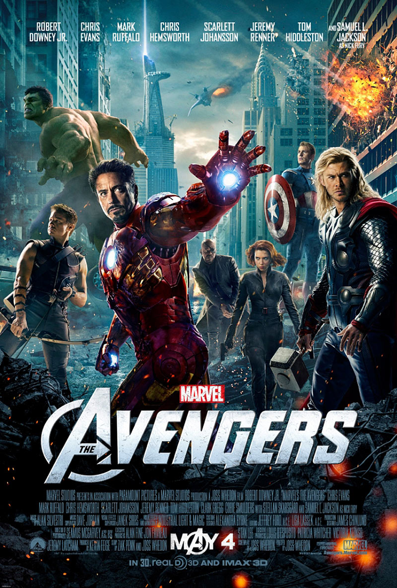

# 🎬 Movie Search App

A simple movie search web application built using HTML, CSS, and JavaScript.

## 🚀 Features

- 🔍 Search movies by title
- 🎬 Display movie posters
- 📅 Display release year
- 🎞️ Display movie type
- 🌐 Uses the OMDb API
- 💻 Simple and user-friendly interface

## 🛠️ Technologies Used

- HTML5
- CSS3
- JavaScript
- OMDb API

## 📸 Project Preview



## 🔐 API Key Security

The API key is stored locally in `config2.js`.

The `config2.js` file is excluded from GitHub using `.gitignore` so that the API key is not publicly exposed.

## 📂 Project Structure

```text
movie_search_app/
│
├── index2.html
├── script2.js
├── style2.css
├── movie-poster.jpg
├── README.md
└── .gitignore
## 👩‍💻 Author
tridebug2225
